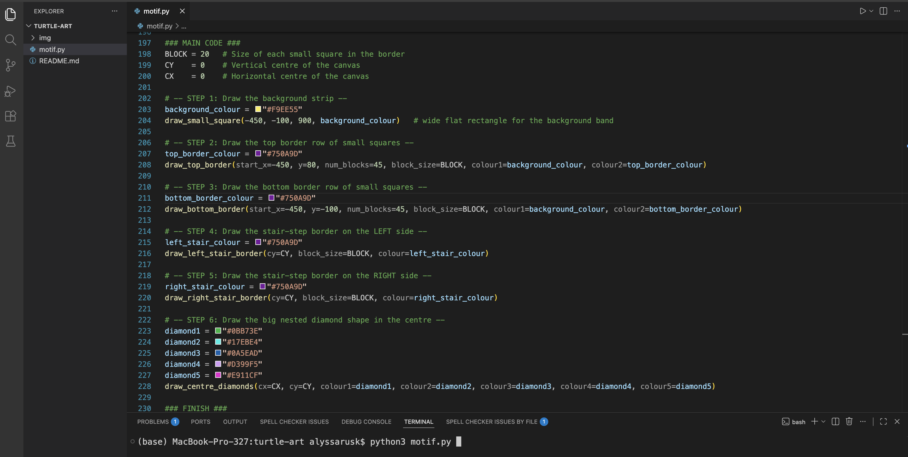
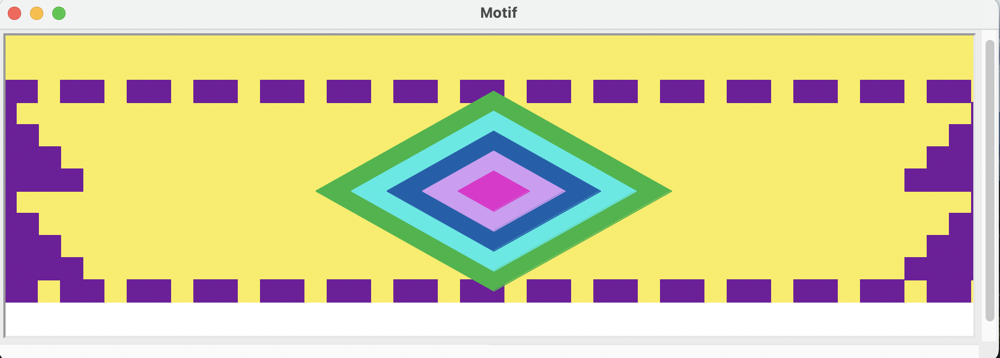
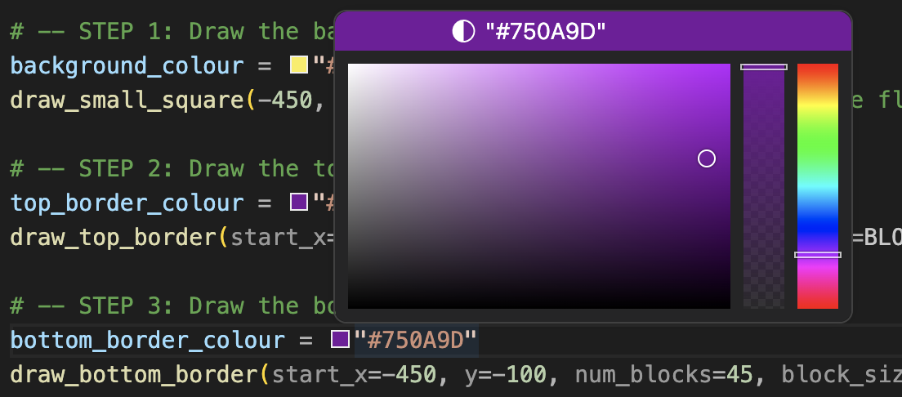
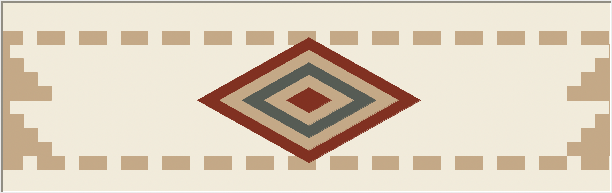

# Turtle Art Activity 

## Overview 
The goal of this activity is to have students walk-through and read code, working on code comprehension. 
Following that, students should use their understanding of the code to edit the design to make it their own or match 
a motif.
Students should walk away with the idea that coding can be used for many things - including art!

## Steps 

### Setup
1. Download this repo using `git clone` or `Download ZIP` under the green `< > Code ↓` button
2. Open up `motif.py` on `Visual Studio Code` (VS Code)
3. Scroll down until you see the main section of the code (line 197), denoted by the comment:
    ```python
    ### MAIN CODE ###
    ```
4. Make sure the terminal is open down below so that you can type the command to run the code



### Code Comprehension
5. When students arrive, have them look through the `Main Code` from Steps 1-6 (lines 202-228) and try to describe what the code is doing
6. They may use the given step comments and the function names to infer what the code is doing
7. You may need to explain what "hex codes" are for the colours
    - "A hex color code is a 6-digit string (starting with a #) used to define colors by specifying the intensity of Red, Green, and Blue (RGB) components"
8. Time permitting, you can ask them "Do you know what a variable is" and discuss how the colours are stored in variables
9. End by running the code using the `python3 motif.py` command in the terminal on the bottom of the VS Code screen
    - You can type this command or, if you have run it before, you can click your `up arrow` key to scroll through previous commands
    - Click `return` (Mac) or `enter` (Windows) to run the command
    - If `python3 motif.py` does not work you may need to use `python motif.py` (no 3)
10. Running the code should open up the animation and students should now see the motif
    - **NOTE:** You will need to close the motif window by clicking the window's `X` button in order to run the animation again.
    Do this before going back to VS Code



### Editing the Motif
11. Now that students understand the code and what motif it produces, now is their chance to trying changing it up!
12. Students can change the colours by editing any of the colour variables in the `Main Code` section
    - This can be done by clicking on the colour box and and dragging the circle to select their chosen colour
    - Notice how the `hex code` changes!
    
    
13. Students may choose their own colours to make the motif their own or, if they are stumped/need to be challenged, they can try to recreate this one inspired by the SFU Gather House


